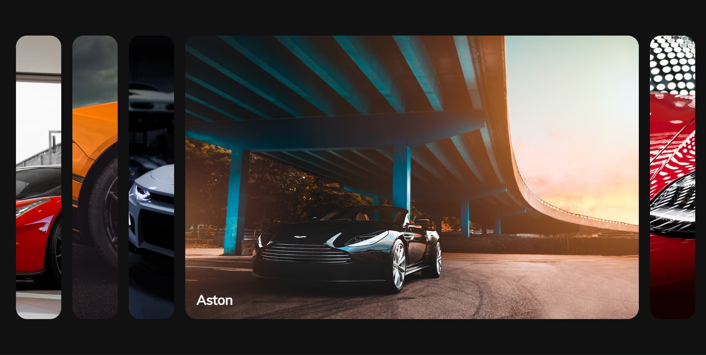

# Animated Cards Gallery

Интерактивная галерея с анимированными карточками автомобилей.  
При клике на карточку она плавно раскрывается, фокусируясь на выбранном элементе и отображая его описание.



---

## 🌟 Функционал

- 🎞️ Плавная анимация открытия карточки  
- 🖱️ Реакция на клик с выбором активного элемента  
- 💡 Минималистичный и современный дизайн  
- 📱 Адаптивная верстка под разные экраны  

---

## 🛠️ Технологии

- **HTML5** — структура проекта  
- **CSS3** — стили, анимации и эффекты  
- **JavaScript (Vanilla JS)** — логика взаимодействия и переключения карточек  

---

## 🚀 Запуск проекта

1. Клонируй репозиторий:
   ```bash
   git clone https://github.com/username/animated-cards.git
   ```
   
2. Перейди в папку проекта:
   ```bash
   cd animated-cards
   ```
   
3. Открой файл:
   ```bash
   index.html
   ```
   
💬 Идея проекта

Проект создан для демонстрации работы с анимациями, DOM-манипуляциями и интерактивными элементами интерфейса.
Он может служить отличным примером практики JS анимаций и CSS переходов.

👨‍💻 Автор

Exmar — Fullstack Developer

📧 Telegram: @Exmar1
